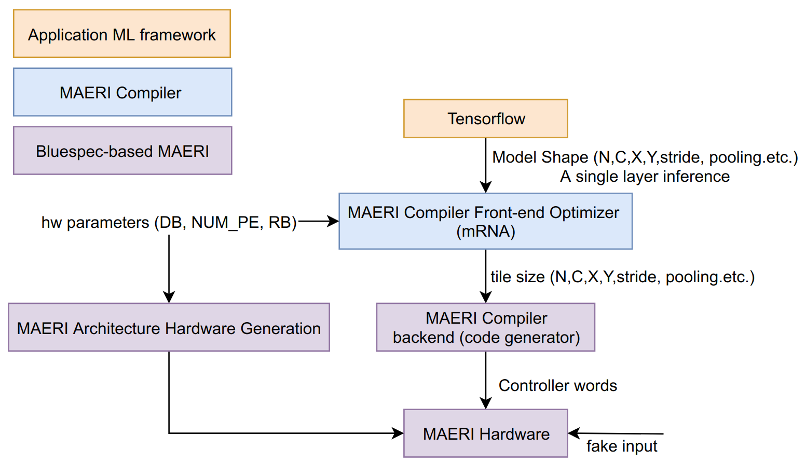

# MAERI_framework


This version of MAERI framework supports simulation from arbitrary convolution layer offered in Keras (Tensorflow backend) to get the **runtime emulation of MAERI**. All the configuration for MAERI will be generated automatically by the Simulation Framework.

Note: We could use size from keras to configure the MAERI with the dummy data flowing through MAERI, such process will not impact the runtime profermance (Specifically the number of cycles the model takes to run on the MAERI). 


# Steps to start simulation
## Prerequiste
• system: ubuntu 18.04.2 LTS (or any alternative version supporting the following packages)

• python: 3.6

• bluespec verilog: (https://bluespec.com/supported-cores please go to the forum for downloading the lastest open-source version.)

• scons: www.sourceforge.net/project/scons

• keras: 2.4.3

• tensorflow: 2.4.1

• mRNA: https://github.com/maeri-project/mRNA (need to install all the prerequistes listed on this github link.)

• MAERI: https://github.com/maeri-project/MAERI_bsv

## Requirement

tested working on python3.6

keras lastest version 

## Ready to run the simulation?
```
git clone https://github.com/maeri-project/MAERI_Framework
./install_MAERI_simulation.sh 
cd MAERI/
rm ./Layer_Info.vmh 
rm ./RN_Config.vmh 
cd ../mRNA/
make -j8
cd ../simulation_framework/
# by default, we are running the first conv layer of VGG16 network.
# edit the simulation_framework.py to change the configuration of MAERI. Specifically, 
# 1. which layer of what Model
# 2. configuration of MAERI, including distribution bandwidth, collection bandwidth, number of multiplers
vim simulation_framework.py
python3 simulation_framework.py
cd ../MAERI/
./MAERI -c all
./MAERI -r
# you will wait for a long time for simulation
```
